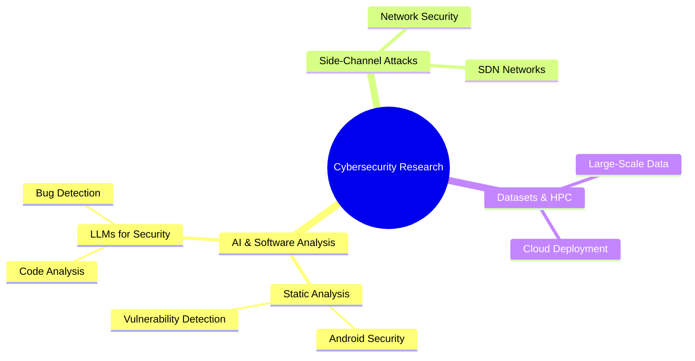
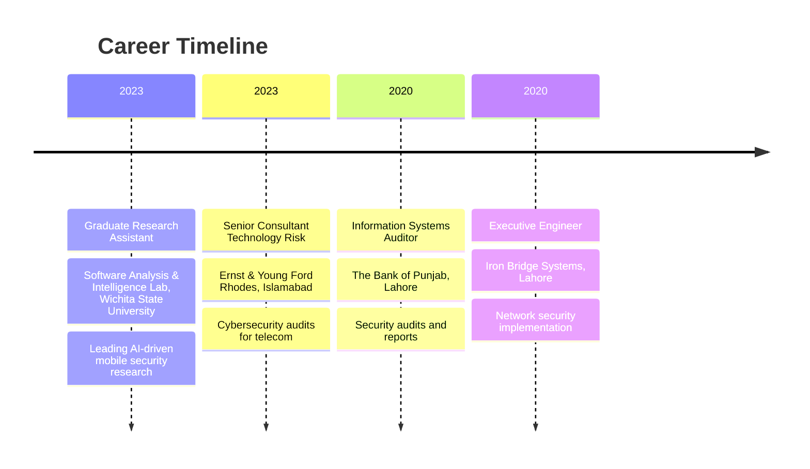
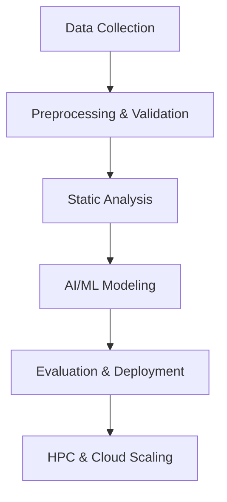

<div align="center">

# Muhammad Tehmasib Ali Tashfeen  
### PhD Candidate • Cybersecurity Researcher • AI & Software Analysis


<p>
  <a href="https://www.linkedin.com/in/ali-b683831a5">
    
  </a>
  <a href="mailto:mxalitashfeen@shockers.wichita.edu">
    
  </a>
  <a href="https://github.com/MuhammadTehamsibAliTashfeen">
    
  </a>
  <a href="https://scholar.google.com/">
    
  </a>
</p>


</div>

---

## 🧠 About Me
I am a **PhD Candidate and Graduate Research Assistant** at Wichita State University's Software Analysis & Intelligence Laboratory, working at the intersection of **Cybersecurity, Artificial Intelligence, and Program Analysis**.

My research focuses on **static analysis for mobile security**, **LLM-assisted vulnerability detection**, and **side-channel attacks in Software-Defined Networks (SDN)**. I build **large-scale, manually validated datasets**, design **automated analysis pipelines**, and deploy models using **HPC and cloud infrastructure**.


---

## 🔬 Research Focus (Visual)
```



---

## 🎓 Education
- **PhD in Electrical Engineering & Computer Science**  
  Wichita State University, Wichita, KS  
  *Aug 2023 – May 2027*

- **Bachelor of Electrical Engineering**  
  National University of Computer and Emerging Sciences, Islamabad, Pakistan  
  *Aug 2015 – May 2019*

---

## 💼 Professional Experience


---

## 🛠️ Key Research Projects


- **Android Memory Leak Dataset**: Curated and validated a large-scale dataset from 650+ GitHub projects for AI-driven security analysis.
- **LLM-Enhanced Bug Detection**: Integrated Large Language Models to improve violation detection in Android codebases.
- **Side-Channel Attacks in SDN**: Authored a survey paper on state-of-the-art attacks in Software-Defined Networks.
- **Hospital Operations Analytics**: Scaled data engineering and ML models for predictive analytics using PySpark, Dask, and cloud infrastructure.

---

## 🛠️ Skills & Technologies
<p align="center">
  
  
  
  
  
  
  
  
</p>

- **Machine Learning & AI**: Logistic Regression, XGBoost, LightGBM, SHAP, LLMs (LangChain, Hugging Face), Prompting, RAG
- **Big Data & Distributed Computing**: PySpark, Dask, Parquet, Delta patterns
- **Cloud & MLOps**: AWS (S3, IAM, ECR, EKS), Docker, Kubernetes, GitHub Actions
- **Data Engineering**: Feature stores, Airflow-style orchestration, Logging/Observability
- **Security Tools**: Soot Framework, Static Analysis, Vulnerability Scanning

---

## 🏆 Certifications
- **Certified Ethical Hacker (CEH v11)** - EC Council
- **Certified in Cybersecurity** - (ISC)²

---

## 🏅 Honors & Awards
- Merit-Based Scholarships and Fellowships
- Best Paper/Presentation Awards at International Conferences
- Competitive Industry and Professional Association Awards

---

## 📊 GitHub Stats
<p align="center">
  
  
</p>

---

## � Random Dev Quote


---

## �🐍 Contribution Snake


---

*Feel free to connect or collaborate on research in cybersecurity and AI!*
