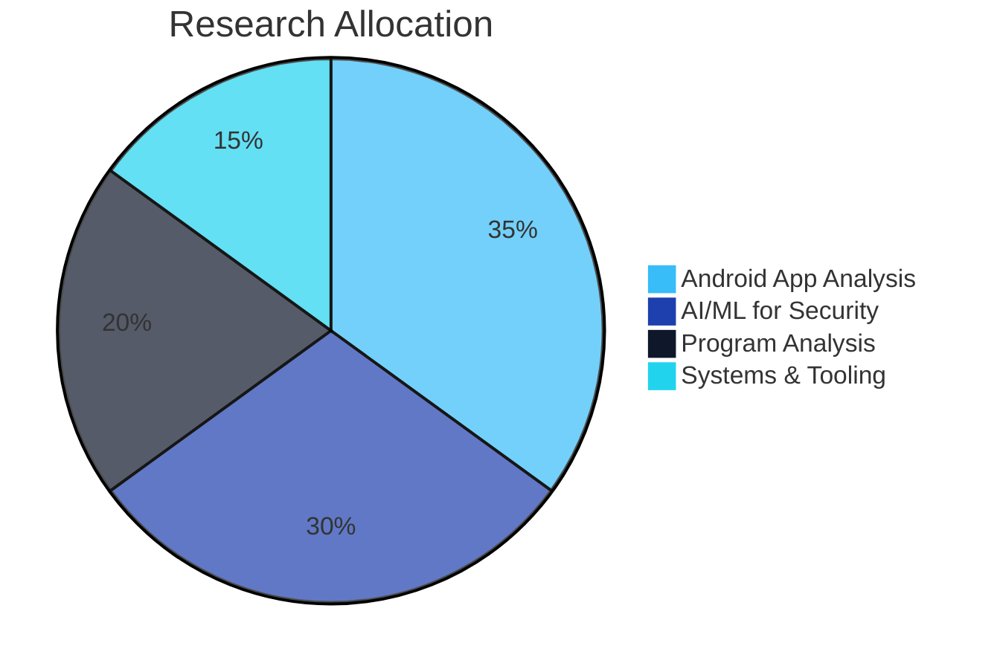
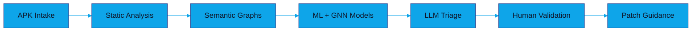
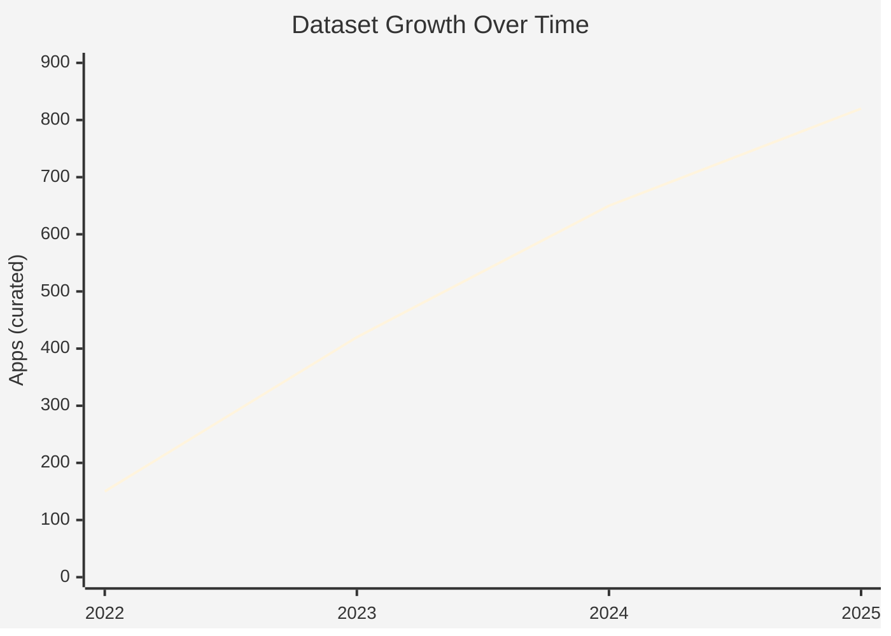
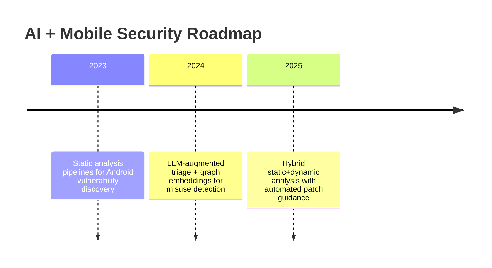

---

## 🔬 Research Identity

I build **AI-assisted mobile security pipelines** that blend program analysis, graph learning, and LLM-guided triage to uncover vulnerabilities in Android ecosystems at scale.

**Core themes**
- **Android App Security**: static + dynamic analysis, taint tracking, API misuse detection
- **AI for Security**: graph neural nets, transformer-based code intelligence, ML-assisted triage
- **Research Engineering**: scalable dataset curation, reproducible pipelines, benchmarking

---

## 📊 Research Focus (Charts)

---

## 🧠 AI-Driven Mobile Security Stack

  
  
  
  
  
  
  
  
  

---

## 📈 Impact Highlights

- Built **large-scale Android datasets** (650+ apps) for vulnerability classification.
- Achieved **92%+ detection accuracy** for memory leak and misuse patterns.
- Scaled pipelines to **10TB+** of code artifacts for robust benchmarking.

---

## 🧪 Current Research Threads

---

## 📊 GitHub Analytics

  
  

  
  

---

**"Advancing AI-driven mobile security through rigorous research and scalable engineering."**

